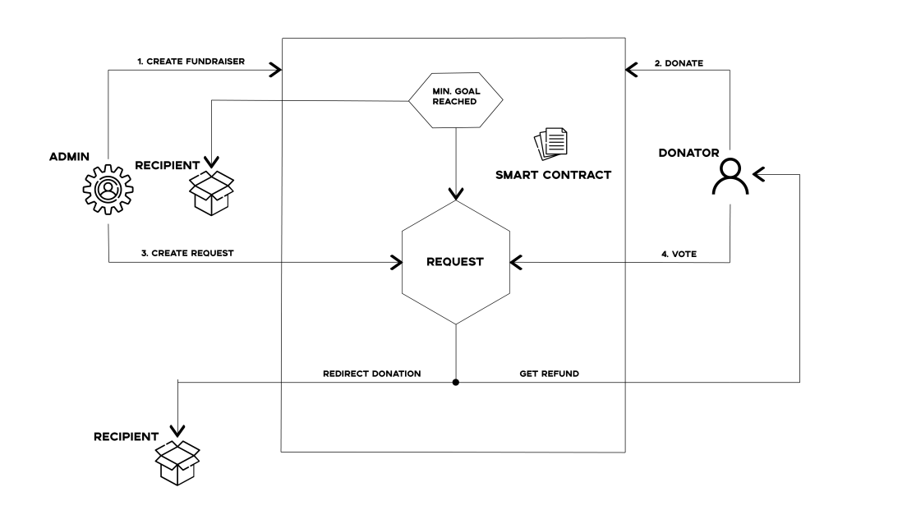

# Decentralized Donation Application on Ethereum

This project aims to implement basic functionalities of a donation platform using Ethereum.

## Why DApp?

The main advantage in this case provided by decentralized applications is certainly transparency. The on-chain nature of
a DApp allows everyone to inspect the code and be more sure about its function. Any interaction with the DApp will be
stored forever in the blockchain.

## Requirements

The Donation DApp allows the admin (foundation owner) to create a donation campaign. Once the campaign is created, it is
available to receive donations. If the minimum goal is met, after the deadline (if any) the money is forwarded to the
recipient. If the minimum goal is not reached, a request is created that allows donors to forward money to another
campaign or to refund funds.

The main components of our Auction DApp are:

* A smart contract that represents a repository of campaigns and allows them to be created

* A smart contract that represents the campaign itself and allows for donations, claim creation, refunds, etc.

* A web frontend using the [React](https://reactjs.org/) framework

* The web3.js library to connect to Ethereum chains (via MetaMask)



### Auction DApp: Backend Smart Contracts

Our Donation DApp is supported by two smart contracts that we need to deploy on an Ethereum blockchain in order to
support the application: Fundraisings and Fundraising. As mentioned, smart contracts are used for the business logic of
the application(donations, contributions, refund and transfer of raised amount).

#### Fundraisings

Represents a repository for created campaigns and contains functions for retrieving created campaigns and creating new
ones. In this way, each campaign is available and saved on the blockchain.


----

```javascript

// SPDX-License-Identifier: MIT
pragma solidity >=0.7.4;

import "./FundRaising.sol";

contract FundRaisings {
    address[] public deployedCampaigns;

    function createCampaign(uint deadline, uint goalInt,uint goalFloat, address recipient) public {
        address newFundRaising = address (new FundRaising(deadline, goalInt, goalFloat, msg.sender, recipient ));
        deployedCampaigns.push(newFundRaising);
    }

    function getDeployedCampaigns() public view returns (address[] memory) {
        return deployedCampaigns;
    }
    
}

```

----

#### Fundraising

It represents the campaign itself and provides key functionalities such as:

* Contributing to the campaign
* Making payments
* Refunding if minimal goal is not met
* Redirecting funds if minimal goal is not met

This contract is too long to include here in full, but the main definition of the contract, data structures and events
is presented. The entire contract is available in the
projects [GitHub](https://github.com/VodnikAngus/sjt/tree/main/src/ethereum/contracts) repository.


----

```javascript

// SPDX-License-Identifier: MIT
pragma solidity >=0.7.4;

contract FundRaising {
    
    mapping(address=>uint) public contributions;
    uint public totalContributors;
    uint public minimumContribution;
    uint public deadline;
    uint public goal;
    uint public raisedAmount = 0 ;
    bool public completed = false;
    address public admin;
    address payable immutable fundRecipient;

     event Donation(
        address _from,
        uint256 _value,
	uint256 _raisedAmount
    );
    
    event GoalReached(
         uint256 _raisedAmount
    );

    

```

----

The Fundraising contract manages all functionalites with the following functions:

----

```javascript

function contribute()
function getBalance()
function getRefund()
function redirectFunds(address newRecipient)
function finalPayment()

```

----


You can deploy these contracts to the Ethereum blockchain of your choice (e.g., Rinkeby) using Truffle in
the [Ethereum](https://github.com/VodnikAngus/sjt/tree/main/src/ethereum) repository:

<pre data-type="programlisting">
$ <strong>truffle init</strong>
$ <strong>truffle compile</strong>
$ <strong>truffle migrate --network rinkeby</strong>
</pre>


In the implementation of the contract, the creator of the campaign has greater privileges than the donor in the sense
that only he can redirect funds after the expiration of the campaign and failure to meet the goal. However, donors
themselves choose what to do with their money so that transparency is not compromised.

### Auction DApp: Frontend User Interface
----

Once the Auction DApp’s contracts are deployed, you can interact with them using your JavaScript console and web3.js, or
another web3 library. However, most users will need an easy-to-use interface. Our Donation DApp user interface is built
using the React framework.

You can start the application with:

<pre data-type="programlisting">
$ <strong>npm install</strong>
$ <strong>npm run</strong>
</pre>

The Donation DApp frontend will launch and will be accessible via any web browser at http://local.host:3000.

### Further Decentralizing the Auction DApp

The address of the primary recipient (if the goal is met) is immutable and public, so that donors can check to whom the
funds are being sent and be sure that this will not change. The problem is if it is necessary to redirect the funds,
because the idea of ​​this application is to forward the money to the one who needs it the most at that moment. So for
that reason, the creator assigns that address just before calling the redirect function. This can cause a problem for
the creator to forward the money to a private address, so the solution could be that the condition before calling the
transfer function is that the address is already a published campaign. Also, the description and image are stored on a
centralized server which should be solved using IPFS, Swarm etc. The notification system should also be decentralized.

## Implementation/Data flow
----

#### 1. Creating a campaign with Fundraisings contract

Creating a campaign is a simple process of entering campaign details such as recipients, goals, etc. The important part
is that the address is immutable and accessible to everyone so that donors can have a clear insight into who the money
will go to if the campaign is successful.

#### 2. Donations

Anyone can donate money at any time until the campaign is over. This is enabled by calling the contribute function.

#### 3.1 Goal/Minimal goal is reached/Final payment

If the goal is reached, the money is paid to the recipient immediately upon reaching it and the campaign is successfully
completed. In the second case, the deadline is waited and it is checked whether the minimum goal has been reached and in
that case the money is forwarded to the recipient and the campaign is also successfully completed.

#### 3.2 Minimal goal is not reached

If the minimum goal is not reached, donors have 7 days to refund their funds. By not refunding the money, they pass it
on to the campaign that needs the money the most.